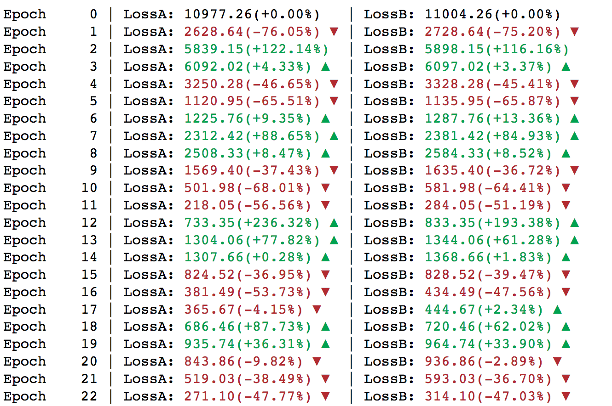

# LossPrettifier 

A handy Python function that prints your model training loss change like stock index. 

## Example

```Python
from lossprettifier import LossPrettifier
reporter = LossPrettifier(show_percentage=True)

for i in range(100):
	# Some Training Functions 
	# loss_A = random.random()
	# loss_B = random.randrange(1,200)
	reporter(epoch=i, LossA = loss_A, LossB = loss_B)
```



## TODO

[] Add more configurable styles 

[] Add [tqdm](https://github.com/tqdm/tqdm) support  

